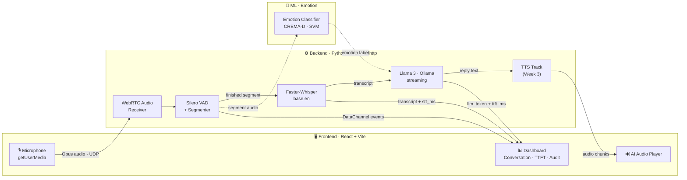
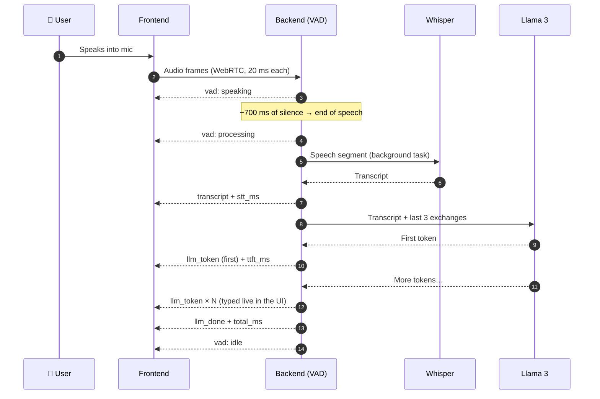

<div align="center">

# 🎙️ AURALIS

### Real-Time Voice-to-Voice Emotion Engine

*Speak naturally. Auralis listens, understands what you said **and how you said it**, and talks back, in real time.*


**Infotact Solutions · Advanced Generative AI Engineering (Vol. II) · Project 2**

</div>

---

## 📌 Table of Contents

1. [The Problem](#-the-problem)
2. [What Auralis Does](#-what-auralis-does)
3. [System Architecture](#-system-architecture)
4. [How One Conversation Turn Works](#-how-one-conversation-turn-works)
5. [Tech Stack](#-tech-stack)
6. [Repository & Branch Structure](#-repository--branch-structure)
7. [Module Deep Dive](#-module-deep-dive)
8. [Real-Time Message Protocol](#-real-time-message-protocol)
9. [Measured Results (Mid-Project Review)](#-measured-results-mid-project-review)
10. [Getting Started](#-getting-started)
11. [Roadmap & Progress](#-roadmap--progress)
12. [Engineering Decisions & Trade-offs](#-engineering-decisions--trade-offs)
13. [Team](#-team)

---

## 🧩 The Problem

Most conversational AI uses a slow, three-step pipeline:

```
Speech-to-Text  →  Text LLM  →  Text-to-Speech
```

This causes two problems:

| Problem | Effect |
|---|---|
| **High latency** | Each stage waits for the previous one to finish completely, so replies take **3–5 seconds**. |
| **Lost emotion** | The LLM only reads text. It never hears the user's **tone** (panic, anger, sadness), so it cannot respond to how the person actually feels. |

## 💡 What Auralis Does

Auralis is a **streaming, emotion-aware voice engine**. The target use case is a **Crisis Negotiation Training Simulator**: a trainee speaks in a panicked voice, and the AI responds with a calm, de-escalating reply whose **tone matches the situation**.

- 🎧 **Streams microphone audio** to the backend over **WebRTC** (UDP), not slow HTTP uploads
- 🗣️ **Detects exactly when you stop speaking** with Silero VAD
- 📝 **Transcribes** the sentence with Faster-Whisper
- 💭 **Classifies the emotion in your voice** from the raw audio (CREMA-D-trained model)
- 🤖 **Replies through a local Llama 3** with an "Auralis" persona, streamed **token by token**
- 🔊 *(Week 3)* **Speaks the reply** with emotion-conditioned TTS, streamed back in audio chunks
- 📊 **Measures every step** live on the dashboard: STT latency, **TTFT**, full reply time, VAD segments

Everything runs **locally**, with no cloud AI APIs, for privacy and full control over latency.

---

## 🏗️ System Architecture



> Solid lines are live today. Dotted lines are being connected in Week 3.

**Key design rule:** the audio **frame loop never waits** for Whisper or the LLM. VAD runs on every 20 ms frame, while transcription and the LLM reply run as **background tasks**. Audio keeps flowing, and the VAD keeps listening, even while Auralis is thinking.

---

## 🔁 How One Conversation Turn Works



All timings are measured **from the moment the VAD detects end of speech**, which is the moment the user starts waiting.

---

## 🛠️ Tech Stack

| Layer | Technology | Why |
|---|---|---|
| **Frontend** | React 19 + Vite 8 | Fast dev loop, simple state for a live dashboard |
| **Transport** | WebRTC (browser) ↔ **aiortc** (Python) | Low-latency UDP audio + a DataChannel for live events |
| **Signaling** | aiohttp `POST /webrtc/offer` | One SDP offer/answer exchange, then everything is peer-to-peer |
| **NAT traversal** | STUN + TURN (config in `.env`) | Works across different networks; tested with **ngrok** |
| **Voice Activity Detection** | **Silero VAD** (ONNX) | Accurate end-of-speech detection on 32 ms chunks |
| **Speech-to-Text** | **Faster-Whisper** `base.en` (int8, CPU) | Local, accurate English STT with prompt biasing |
| **LLM** | **Llama 3.2 3B** via **Ollama** | Local, streamed, with conversation memory |
| **Emotion** | Temporal acoustic features + SVM (RBF) | Trained on **CREMA-D** (7,442 clips, 6 emotions) |
| **TTS** *(Week 3)* | XTTSv2 / Bark | Zero-shot, emotion-conditioned voice |

---

## 🌿 Repository & Branch Structure

Each team member owns one branch. `main` holds the project documentation.

| Branch | Owner | Contents |
|---|---|---|
| `main` | Team | This README: architecture, protocol, progress |
| [`frontend`](../../tree/frontend) | **Ankit Dash** | `frontend/`: React dashboard, WebRTC client |
| [`Backend`](../../tree/Backend) | **Priya Nirmal** | `Backend/`: aiortc server, VAD, STT, LLM streaming |
| [`ML`](../../tree/ML) | **Siddhant** | `ml/`: emotion dataset, features, models, LLM prompts |

```
Auralis/
├── frontend/                       # branch: frontend
│   ├── src/App.jsx                 # WebRTC client, DataChannel handler, dashboard
│   ├── src/App.css                 # "Midnight Aurora" theme
│   └── src/ui-polish.css           # Conversation panel, metric styling
│
├── Backend/                        # branch: Backend
│   ├── app/main.py                 # aiohttp app, model warm-up at startup
│   ├── app/webrtc/                 # server.py · audio_track.py · tts_track.py
│   ├── app/audio/vad/detector.py   # Silero VAD (stateful resampler)
│   ├── app/audio/processor.py      # segmenting: pre-roll, hangover, min-voice filter
│   ├── app/stt/                    # transcriber.py · engine.py (shared Whisper)
│   ├── app/llm/ollama_client.py    # async streaming Llama client
│   └── tests/                      # pytest suite
│
└── ml/                             # branch: ML
    ├── src/features/               # MFCC, spectral, prosodic, temporal features
    ├── src/models/                 # training, tuning, inference
    ├── src/llm/                    # persona + emotion-aware prompts
    └── results/                    # confusion matrices, experiment logs
```

---

## 🔬 Module Deep Dive

<details>
<summary><b>🎙️ Frontend: WebRTC client & live dashboard</b> (Ankit)</summary>

<br/>

- **Mic capture** with browser echo cancellation, noise suppression and auto-gain (stronger, cleaner signal for VAD and Whisper)
- **WebRTC handshake** with smart ICE gathering: stops early once a TURN relay candidate is ready, with a 3 s timeout
- **Live mic level meter** (dB), updated through refs at 60 fps without re-rendering React
- **Conversation panel:** your sentence and Auralis's reply as chat bubbles, with the reply **typed live token by token**
- **Latency dashboard:** Speech→Text, **TTFT**, average TTFT, full reply time, colour-coded against the 800 ms target
- **Transcription Audit:** every VAD segment with speech length, silence wait, gap before, and whether it was transcribed
- **AI audio status:** detects the remote audio track, packet counter, autoplay-blocked recovery
- Performance-safe: frame counter throttled (50 msgs/s → 5 renders/s); segment↔transcript matching via a FIFO queue

</details>

<details>
<summary><b>⚙️ Backend: streaming pipeline</b> (Priya)</summary>

<br/>

- **aiortc server**: receives the browser's mic track, sends an outgoing audio track (for TTS) and a DataChannel
- **Silero VAD**: 48 kHz → 16 kHz with a **stateful** resampler (no clicks at frame edges); threshold 0.5; start after 3 speech chunks (~96 ms), end after 22 silence chunks (~700 ms)
- **Segmenter**: 300 ms pre-roll (first syllable is never cut), 100 ms hangover, **minimum 200 ms of real voice** (coughs and desk taps never reach Whisper), forced split at 15 s
- **Faster-Whisper `base.en`**: `beam_size=5`, `initial_prompt` with project names and terms, `condition_on_previous_text=False`, hallucination filter (`no_speech_prob` + known phantom phrases like *"Thank you."*)
- **Non-blocking turns**: Whisper + LLM run as background tasks; the audio loop never stalls
- **Model warm-up at startup**: Whisper and Llama are loaded before the first user connects
- **Async streaming LLM client** (aiohttp), sending `llm_token` events as tokens arrive, plus `ttft_ms` and `total_ms`

</details>

<details>
<summary><b>🧠 ML: emotion recognition & LLM persona</b> (Siddhant)</summary>

<br/>

- **Dataset:** CREMA-D, 7,442 clips, 91 actors, 6 emotions (angry, disgust, fear, happy, neutral, sad), with actor-independent train / validation / test splits
- **Feature engineering:** MFCC + deltas, spectral and energy features, prosody, and **temporal features (2,400 dimensions)**
- **Experiments:** Random Forest baseline → SVM (linear / RBF) → class-weight tuning → **noise-augmented training** for robustness
- **Best model:** Temporal SVM (RBF): **48.9 % test accuracy, 0.48 macro-F1** on 6 classes (chance = 16.7 %)
- **LLM persona:** concise, empathetic "Auralis" with 1–2 sentence replies; the detected emotion is passed as *possibly-imperfect* context
- **Streaming Ollama client** (token generator), integrated into the backend

</details>

---

## 📡 Real-Time Message Protocol

All live events travel from backend to frontend over the WebRTC **DataChannel** as JSON.

| `type` | When | Key fields |
|---|---|---|
| `audio_frame` | Every 20 ms frame | `frame`, `is_speech`, `segment_started`, `segment_finished`, `sample_rate`, `samples` |
| `vad` | Speech state changes | `vad_state`: `speaking` / `processing` / `idle` |
| `transcript` | Whisper finished | `text`, `stt_ms` |
| `llm_start` | LLM begins replying | — |
| `llm_token` | Each streamed token | `text`, `first`, `ttft_ms` *(first token only)* |
| `llm_done` | Reply complete | `text`, `ttft_ms`, `total_ms`, `tokens` |
| `llm_error` | Ollama unreachable / failed | `error` |
| `audio_error` | Frame processing failed | `frame`, `error` |

**Timing definitions** (all measured from the end of the user's speech):

| Metric | Meaning |
|---|---|
| `stt_ms` | End of speech → transcript ready |
| `ttft_ms` | End of speech → **first word** from the LLM *(mid-project "Latency Check")* |
| `total_ms` | End of speech → **last word** from the LLM |

---

## 📊 Measured Results (Mid-Project Review)

Measured live on a laptop **CPU** (no GPU), across two networks connected through ngrok.

### ✅ Transcription Audit

| Check | Result |
|---|---|
| Segments detected vs transcribed | **5 / 5** |
| Silence wait after speech | **~100 ms hangover** on top of the 700 ms VAD window |
| Full sentences kept together | ✅ e.g. *"What are you doing? I am currently watching Big Boss."* |
| Names and project terms | ✅ *"Ankit Dash"*, *"Priya"*, *"Siddhant"*, *"Auralis"* |
| Noise / coughs | ✅ filtered before Whisper (no phantom *"Thank you."*) |

### ⏱️ Latency Check

| Stage | Measured | PDF target |
|---|---|---|
| Speech → Text (Whisper `base.en`, CPU) | **~1.2 s** | < 200 ms |
| TTFT, Llama 3 **8B** on CPU | 2.6 – 8.9 s | — |
| TTFT, Llama 3.2 **3B** on CPU | *re-measuring* | — |
| End-to-end voice reply | *Week 3* | < 800 ms |

**Where the time goes:** about 0.7 s is the deliberate silence window, so sentences are not cut mid-thought. The rest is Whisper and the LLM on CPU. `ollama ps` showed Llama 3 8B at **100 % CPU**, so we switched to **Llama 3.2 3B**. The sub-800 ms target needs **GPU inference**; the architecture (streaming, background tasks, warm-up) is already built for it.

---

## 🚀 Getting Started

### Prerequisites

- **Python 3.12**, **Node.js 18+**
- **[Ollama](https://ollama.com)** with the model pulled:
  ```bash
  ollama pull llama3.2:3b
  ```

### 1 · Backend (`Backend` branch)

```bash
git checkout Backend
cd Backend
python -m venv .venv
.venv\Scripts\activate          # Windows  (macOS/Linux: source .venv/bin/activate)
pip install -r requirements.txt
copy .env.example .env          # sets PORT=8001  (macOS/Linux: cp)
python -m app.main
```

Wait for:

```
[STT] Warm-up done in ... ms
[LLM] Warm-up done (model=llama3.2:3b)
[STARTUP] Ready
```

Health check: `GET http://localhost:8001/health` → `{"status": "ok"}`

> Testing across two networks? Expose the backend with `ngrok http 8001` and use the ngrok URL as `VITE_BACKEND_URL`.

### 2 · Frontend (`frontend` branch)

```bash
git checkout frontend
cd frontend
npm install
```

Create `frontend/.env` (never commit this file):

```env
VITE_BACKEND_URL=http://localhost:8001
VITE_TURN_URL=turn:your-turn-server:80
VITE_TURN_USERNAME=your-username
VITE_TURN_CREDENTIAL=your-password
```

```bash
npm run dev
```

Open **http://localhost:5173** → **START MIC** → **CONNECT** → start talking.

---

## 🗺️ Roadmap & Progress

| Week | Audio ML & Generative Models | Streaming Architecture | Status |
|---|---|---|---|
| **1** | Local STT with Faster-Whisper | React app + aiortc server, bi-directional WebRTC audio | ✅ Done |
| **2** | LLM integration: Llama 3 via Ollama with a conversational persona | Silero VAD: exact end-of-speech detection | ✅ Done |
| **Mid-Review** | Transcription Audit | Latency Check (TTFT) | ✅ Done |
| **3** | Emotion-conditioned zero-shot TTS (calm vs panicked) | Chunked TTS audio streaming over WebRTC | 🔄 In progress (outgoing audio track ready) |
| **4** | Full-duplex interruption handling | Live waveform visualizer (user + AI) | ⏳ Planned |
| **Final** | STT + emotion + LLM + TTS running concurrently | Sub-second, emotionally resonant conversation | ⏳ Planned |

---

## ⚖️ Engineering Decisions & Trade-offs

| Decision | Why | Trade-off |
|---|---|---|
| **WebRTC instead of HTTP/WebSocket uploads** | UDP transport, built-in Opus codec, jitter buffering, echo cancellation | More complex setup (SDP, ICE, TURN) |
| **700 ms silence window** | Keeps full sentences together; short pauses and "uh" no longer split them | Adds ~0.7 s before transcription starts |
| **`beam_size=5` + `initial_prompt` in Whisper** | Fixed mishearings like *"Ankida"* → *"Ankit Dash"*, *"BTEK"* → *"BTech"* | Slower than greedy decoding |
| **Minimum-voice filter (200 ms)** | Coughs and taps never reach Whisper, which removed phantom transcripts | Very short words on their own may be skipped |
| **Background turn tasks** | The audio loop never blocks, which is required for Week 4 interruptions | Overlapping turns must be serialized (lock) |
| **Model warm-up at startup** | The first reply isn't slowed by model loading | Slower server start |
| **Llama 3.2 3B instead of Llama 3 8B** | 8B ran at 100 % CPU with TTFT up to ~9 s | Slightly less capable replies |
| **Local models only** | Privacy, no API cost, full latency control | Hardware-bound speed (GPU recommended) |

---

## 👥 Team

| Member | Role | Owns |
|---|---|---|
| **Ankit Dash** | Frontend & Real-Time UI | WebRTC client, live dashboard, latency instrumentation, conversation UI |
| **Priya Nirmal** | Backend & Streaming | aiortc server, VAD, STT pipeline, LLM integration, audio streaming |
| **Siddhant** | ML & Generative Models | Emotion recognition, feature engineering, LLM prompting, TTS |

---

<div align="center">

**Auralis** · built for the Infotact Solutions Advanced Generative AI Engineering programme

*Real-time · Local-first · Emotion-aware*

</div>
