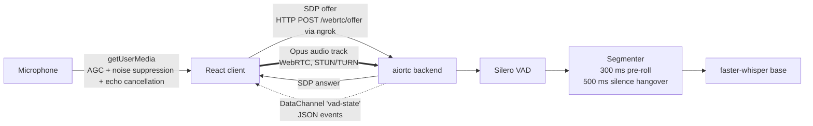

# Auralis — Frontend

**Real-time Voice-to-Voice (V2V) Emotion Engine — browser client.**
React + native WebRTC dashboard that streams live microphone audio to the Auralis backend and visualises voice activity, transcripts, latency and segmentation quality in real time.

Part of Infotact Solutions' *Advanced Generative AI Engineering* internship (Project 2 of 3).

| Role | Owner | Branch |
|---|---|---|
| **Frontend / streaming UI (this module)** | Ankit Dash | `frontend` |
| Backend / WebRTC + VAD + STT | Priya Nirmal | `Backend` |
| Audio ML / emotion recognition | Siddhant | `ML` |

---

## Why Auralis

Most conversational AI chains **Speech-to-Text → LLM → Text-to-Speech** over slow request/response calls, which adds 3–5 s of delay and discards the speaker's emotional tone. Auralis streams audio continuously over WebRTC, detects when the user stops speaking, transcribes it, and (in later weeks) responds with an emotion-matched voice — targeting **sub-800 ms** responses.

**Use case:** a Crisis Negotiation Training Simulator, where a trainee speaks under pressure and the AI de-escalates in a tone matched to their emotional state.

---

## Architecture



- **Signalling** is a single HTTP exchange (offer → answer). After that, everything flows over the peer connection.
- **Audio** travels as a WebRTC media track (UDP, low latency).
- **Results** (VAD state, transcripts, per-frame telemetry) come back over a WebRTC **DataChannel**, so the UI never polls.

---

## Features

| Feature | What it does |
|---|---|
| **WebRTC connection** | Offer/answer signalling, STUN + TURN, ICE gathering with early exit and a 3 s cap |
| **Mic capture** | Browser AGC, noise suppression and echo cancellation enabled for a clean, strong signal |
| **Live mic level meter** | Web Audio `AnalyserNode` → RMS → dB, 60 fps, rendered directly to the DOM (no React re-renders) with quiet / good / loud zones |
| **Voice activity display** | Live SPEAKING → PROCESSING → IDLE state from the backend's Silero VAD |
| **Live transcript** | Scrolling, timestamped history with per-utterance latency |
| **Latency check** | End-of-speech → transcript, per utterance and averaged, colour-coded against the 800 ms target |
| **Transcription audit** | Per-segment speech duration, silence-wait threshold, gap between segments, and transcribed vs empty |
| **Connection diagnostics** | ICE candidate counts (host / srflx / relay), reason gathering ended, total connect time |
| **System event log** | Last 30 meaningful events; high-frequency telemetry is filtered out |
| **Error handling** | Clear messages for denied mic, missing mic, missing config, 404, 403 (CORS), unreachable backend, failed media, blocked autoplay |

---

## DataChannel protocol

The frontend opens a DataChannel labelled `vad-state`. The backend sends JSON messages:

| `type` | Fields | Frequency | Frontend behaviour |
|---|---|---|---|
| `audio_frame` | `frame`, `sample_rate`, `samples`, `is_speech`, `segment_started`, `segment_finished`, `segment_frame_count`, `latency_ms` | ~50/s (one per 20 ms frame) | Updates counters and segment tracking silently; never logged |
| `vad` | `vad_state`: `speaking` \| `processing` \| `idle` | Per utterance | Updates the VAD badge, logs the event |
| `transcript` | `text` | Per utterance | Appends to the transcript, records latency, marks the audit segment |
| `audio_error` | `frame`, `error` | On failure | Logs the backend error |

Per-utterance sequence: `vad: speaking` → `vad: processing` → `transcript` → `vad: idle`.

---

## Week 2 results — Transcription Audit & Latency Check

The audit panel was built to prove the mid-project review criteria: *"accurately transcribes continuous speech and detects silence thresholds"* and *"measure latency"*. Running it exposed real pipeline bugs, which were then fixed:

| Metric | Run 1 (initial) | Run 2 (backend segmentation fix) | Run 3 (+ mic AGC, log cleanup) |
|---|---|---|---|
| Silence threshold | 20 ms (ended on first quiet frame) | 500 ms | **500 ms, consistent** |
| Segments transcribed | 3 / 8, sentences split and clipped | 8 / 8, words garbled | **4 / 5, long sentence kept in one segment** |
| Speech → text latency | Invalid (6–40 ms — measurement masked by a blocked event loop) | 2–15 s, growing | **~1.7 s, steady** |

**Root causes found and fixed**

1. *Backend:* segments ended on the first silent frame → added a 500 ms silence hangover and 300 ms pre-roll.
2. *Backend:* Whisper ran on the asyncio event loop, freezing WebRTC during transcription → moved processing to a worker thread (`asyncio.to_thread`).
3. *Frontend:* browser auto gain control had been disabled for debugging, so Silero's speech probability was only 0.20–0.39 → re-enabled AGC, noise suppression and echo cancellation (probability now 0.52–0.92).
4. *Backend:* per-frame logging (100+ lines/s) caused a growing processing backlog → removed.

**Latency breakdown** (frontend measurement matches backend `processing_ms`):

| Stage | Time |
|---|---|
| Silence wait (end-of-speech detection) | 500 ms |
| faster-whisper `base`, CPU, int8 | ~1,100–1,250 ms |
| **Total, measured in the browser** | **~1,700 ms** |

Whisper is ~70 % of the total. Paths toward the 800 ms target: a smaller model (`tiny.en`), GPU inference, or a shorter silence wait.

---

## Getting started

**Prerequisites:** Node.js 18+, and the Auralis backend running (see the `Backend` branch).

```bash
git clone https://github.com/Ankit-builds1/Auralis.git
cd Auralis
git checkout frontend
cd frontend
npm install
```

Create `frontend/.env` (next to `package.json`, **not** inside `src/`):

```
VITE_BACKEND_URL=https://<backend-ngrok-url>.ngrok-free.dev
```

On Windows PowerShell, create it with ASCII encoding (see Troubleshooting):

```powershell
Set-Content -Path .env -Value "VITE_BACKEND_URL=https://<backend-ngrok-url>.ngrok-free.dev" -Encoding ascii
```

Run:

```bash
npm run dev   # must be http://localhost:5173 — the backend's CORS allows only this origin
```

**Usage:** STOP → START MIC → CONNECT → wait for ICE State `connected` → speak, then pause for a moment.

---

## Troubleshooting

| Symptom | Cause | Fix |
|---|---|---|
| Request goes to `.../undefined/webrtc/offer` | `.env` not loaded | Put `.env` in `frontend/`, not `src/`, and restart `npm run dev` |
| `.env` exists but URL is still `undefined` | PowerShell `>` writes UTF-16, which Vite can't read | Recreate with `Set-Content ... -Encoding ascii` |
| `403` / CORS error | Dev server on 5174 instead of 5173 | Close other `npm run dev` terminals, restart on 5173 |
| `ERR_CONNECTION_REFUSED` / "Could not reach the backend" | Backend or ngrok not running, or stale URL | Ask for the current ngrok URL; free URLs change on restart |
| ngrok URL ends in `.ngrok-free.d` | Terminal window too narrow | The real URL ends in `.dev` |
| Frames stay at 0 | DataChannel not delivering | Confirm the backend is running its latest commit |
| Mic meter stays grey while speaking | Mic too quiet or wrong input device | Check the OS input device and level |
| Garbled or split transcripts | Weak mic signal | Keep AGC enabled; speak at normal volume |

---

## Mid-project review demo checklist

**Setup (before the call)**
- [ ] Backend running on its latest commit, ngrok active, URL in `.env`
- [ ] Frontend on `localhost:5173`, transcript and audit cleared

**Live demo (~3 minutes)**
1. **Connect** — START MIC → CONNECT. Point out the event log: ICE gathering reason, candidate types, connect time.
2. **Mic meter** — speak and show the bar entering the green zone.
3. **VAD** — say a sentence; show SPEAKING → PROCESSING → IDLE.
4. **Transcription** — say *"The weather is nice today."* and show the transcript.
5. **Continuous speech** — say one long sentence; show it stays **one row** in the audit table.
6. **Silence threshold** — point to the **500 ms** Silence wait, identical on every row.
7. **Non-speech** — cough once; show it flagged `✗ empty` instead of producing text.
8. **Latency** — show the ~1.7 s average and explain the breakdown table above.

**Evidence to keep:** screenshots of Run 1 and Run 3 of the audit, and the backend log showing `processing_ms`.

---

## Progress log

### Week 1 — WebRTC foundation ✅
> *Plan: build the frontend React app and backend aiortc server to establish a bi-directional audio stream.*

| Day | Work |
|---|---|
| 1 | Vite + React scaffold, ESLint, microphone capture with `getUserMedia` |
| 2 | `RTCPeerConnection`, mic track attached, SDP offer generated |
| 3 | Offer sent to the backend's `/webrtc/offer`, answer applied, STUN/TURN configured — handshake verified end-to-end |
| 4 | Remote audio playback via `ontrack` → `<audio>`; round trip verified |
| 5 | Error handling for mic, configuration, HTTP and connection failures |

### Week 2 — Voice Activity Detection ✅
> *Plan: implement Silero VAD to detect when the user stops speaking. Mid-project review: transcription audit and latency check.*

| Day | Work |
|---|---|
| 1 | DataChannel (`vad-state`) created and accepted, ICE-gathering wait, VAD badge |
| 2 | Transcript handling |
| 3 | End-to-end STT connected; transcript history; `audio_frame` filtering; frame counter; mic double-start guard |
| 4 | Latency check: end-of-speech → transcript, per utterance and average |
| 5 | Transcription audit panel; exposed and helped fix four pipeline bugs (see results above) |
| 6 | Live mic level meter; faster ICE gathering (early exit + 3 s cap, previously a fixed 10 s wait); connection diagnostics |
| 7 | Documentation and mid-project demo checklist (this README) |

---

## Known limitations

- **TTFT not yet measurable.** The plan's latency check is end-of-speech → first LLM token. The Llama 3 integration is pending, so the frontend currently measures end-of-speech → transcript. When the backend sends LLM output over the DataChannel, the same timer can stop on the first token instead.
- **Latency is above the 800 ms target** (~1.7 s), dominated by Whisper on CPU.
- **Whisper `base` accuracy** — occasional word substitutions on fast or unclear speech.
- **Free public TURN server** is unreliable; production needs a dedicated TURN service.
- **ngrok free URLs** change on every restart and must be updated in `.env`.
- **First sentence after connecting** can occasionally be clipped while browser AGC settles.

---

## Roadmap

- **Week 3:** Receive emotion data from the ML pipeline; play streamed TTS audio chunks; measure true TTFT once the LLM is connected
- **Week 4 (Refine & Polish):** Waveform visualiser reacting to both user and AI audio, emotion-driven colour shifts, interruption handling UI (AI stops when the user speaks)

---

## Tech stack

React 19 · Vite · native WebRTC (`RTCPeerConnection`, `RTCDataChannel`, `getUserMedia`) · Web Audio API (`AnalyserNode`) · ESLint

## Project structure

```
frontend/
├── src/
│   ├── App.jsx      # WebRTC client, DataChannel protocol, metrics, UI
│   ├── App.css      # Dashboard styles
│   └── main.jsx
├── .env             # VITE_BACKEND_URL (not committed)
├── package.json
└── vite.config.js
```
