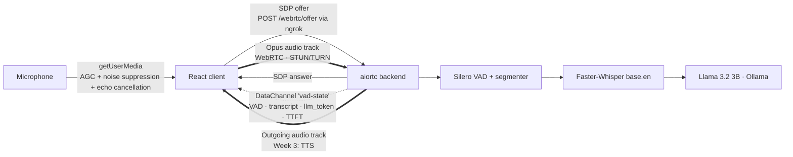

# Auralis — Frontend

**Real-time Voice-to-Voice (V2V) Emotion Engine: browser client.**

A React + native WebRTC dashboard that streams live microphone audio to the Auralis backend and shows, in real time, what the system hears, what it understood, how Auralis replies, and how long every step took.

Part of Infotact Solutions' *Advanced Generative AI Engineering* internship (Project 2).

| Role | Owner | Branch |
|---|---|---|
| **Frontend: WebRTC client + live dashboard (this module)** | Ankit Dash | `frontend` |
| Backend: WebRTC, VAD, STT, LLM streaming | Priya Nirmal | `Backend` |
| ML: emotion recognition + LLM prompts | Siddhant | `ML` |

---

## Why Auralis

Most conversational AI chains **Speech-to-Text → LLM → Text-to-Speech** over slow request/response calls, adding 3–5 s of delay and discarding the speaker's tone. Auralis streams audio continuously over WebRTC, detects when the user stops speaking, transcribes it, and streams a reply from a local LLM token by token, aiming for **sub-800 ms** voice responses.

**Use case:** a Crisis Negotiation Training Simulator, where a trainee speaks under pressure and the AI de-escalates in a tone matched to their emotional state.

---

## Architecture



- **Signalling:** one HTTP exchange (offer → answer). After that, everything flows over the peer connection.
- **Audio:** sent as a WebRTC media track (UDP, low latency).
- **Results:** VAD state, transcripts, streamed LLM tokens and timings come back over a WebRTC **DataChannel**, so the UI never polls.

---

## Features

| Feature | What it does |
|---|---|
| **WebRTC connection** | Offer/answer signalling, STUN + TURN (from `.env`), ICE gathering with early exit on a relay candidate and a 3 s cap |
| **Mic capture** | Browser AGC, noise suppression and echo cancellation for a clean, strong signal |
| **Live mic level meter** | Web Audio `AnalyserNode` → RMS → dB at 60 fps, written straight to the DOM (no React re-renders), quiet / good / loud zones |
| **Voice activity display** | Live SPEAKING → PROCESSING → IDLE from the backend's Silero VAD |
| **Conversation panel** | Your sentence and Auralis's reply as chat bubbles; the reply **types in live, token by token**, with "thinking" dots while waiting |
| **Per-turn badges** | STT time on your bubble; **TTFT** and total reply time on Auralis's bubble |
| **Latency dashboard** | Speech → Text (last + average), **TTFT (last)**, **average TTFT**, full reply time, colour-coded against the 800 ms target |
| **Transcription audit** | Per-segment speech duration, silence wait, gap before, transcribed vs empty |
| **AI audio status** | Detects the backend's outgoing audio track, live packet counter from WebRTC stats, recovery button if autoplay is blocked |
| **Connection diagnostics** | ICE candidate counts (host / srflx / relay), why gathering ended, total connect time |
| **System event log** | Last 30 meaningful events; high-frequency messages (frames, tokens) are never logged |
| **Error handling** | Clear messages for denied/missing mic, missing config, 404, 403 (CORS), unreachable backend, failed media, blocked autoplay, LLM errors |
| **Performance** | Frame counter throttled (50 msgs/s → 5 renders/s); segment ↔ transcript matching with a FIFO queue so fast back-to-back sentences never get mixed up |

---

## DataChannel protocol

The frontend opens a DataChannel labelled `vad-state`. The backend sends JSON messages:

| `type` | Fields | Frequency | Frontend behaviour |
|---|---|---|---|
| `status` | `status` | Once | Updates the status card |
| `audio_frame` | `frame, sample_rate, samples, is_speech, segment_started, segment_finished, segment_frame_count, latency_ms` | ~50/s | Frame counter + segment tracking; never logged |
| `vad` | `vad_state`: `speaking` \| `processing` \| `idle` | On change | Updates the VAD badge |
| `transcript` | `text, stt_ms` | Per utterance | Adds a new conversation turn, records STT latency, marks the audit row |
| `llm_start` | — | Per reply | Shows "thinking" dots in the AI bubble |
| `llm_token` | `text, first, ttft_ms` *(first only)* | Per token | Appends to the AI bubble; records **TTFT** on the first token |
| `llm_done` | `text, ttft_ms, total_ms, tokens` | Per reply | Finalises the bubble, records total reply time |
| `llm_error` | `error` | On failure | Shows the error in the AI bubble |
| `audio_error` | `frame, error` | On failure | Logs the backend error |

**One turn:** `vad: speaking` → `vad: processing` → `transcript` → `llm_start` → `llm_token` × N → `llm_done` → `vad: idle`

All timings come from the backend and are measured **from the moment the VAD detects end of speech**, so network delay doesn't distort them.

---

## Week 2 results: Transcription Audit & Latency Check

The audit panel was built to prove the mid-project review criteria: *"accurately transcribes continuous speech and detects silence thresholds"* and *"measure latency (TTFT)"*. Each run exposed real pipeline issues that the team then fixed:

| Metric | Run 1 (initial) | Run 2 (segmentation fix) | Run 3 (+ mic AGC, log cleanup) | **Run 4 (final Week 2 pipeline)** |
|---|---|---|---|---|
| End-of-speech detection | Ended on the first quiet frame | 500 ms hangover | 500 ms | **~700 ms VAD window + 100 ms hangover** |
| Segments transcribed | 3 / 8, sentences split | 8 / 8, words garbled | 4 / 5 | **5 / 5, names correct** |
| Speech → text | Invalid (event loop blocked) | 2–15 s, growing | ~1.7 s, steady | **~1.2 s** |
| TTFT (first LLM word) | — | — | Not possible (no LLM) | **2.6 – 8.9 s** (Llama 3 8B, CPU) |

**Issues found through the audit and fixed**

1. Segments ended on the first silent frame → pre-roll + silence hangover added.
2. Whisper ran on the asyncio event loop and froze WebRTC → moved to background tasks.
3. Browser AGC had been disabled for debugging, so VAD speech probability was only 0.20–0.39 → re-enabled (now 0.52–0.92).
4. Per-frame logging caused a growing backlog → removed.
5. Sentences split at short pauses, names misheard ("Ankida", "BTEK") → VAD threshold 0.5 + 700 ms window; Whisper `base.en` with `beam_size=5` and an `initial_prompt`.
6. Coughs produced phantom "Thank you." → minimum real-voice filter + hallucination filter.
7. Silence was counted twice (~1.2 s wait) → hangover reduced to 100 ms.
8. UI stuck on PROCESSING → backend now sends `idle` after each turn.

**Where the time goes:** ~0.7 s is the deliberate silence window (keeps sentences whole). The rest is Whisper and the LLM on a laptop CPU; `ollama ps` showed Llama 3 8B at 100 % CPU, so the backend switched to Llama 3.2 3B. The sub-800 ms target needs GPU inference.

---

## Getting started

**Prerequisites:** Node.js 18+, and the Auralis backend running (see the `Backend` branch).

```bash
git clone https://github.com/Ankit-builds1/Auralis.git
cd Auralis
git checkout frontend
cd frontend
npm install
```

Create `frontend/.env` (next to `package.json`, **not** inside `src/`). It's gitignored, so never commit it:

```env
VITE_BACKEND_URL=https://<backend-ngrok-url>.ngrok-free.dev
VITE_TURN_URL=turn:<turn-server>:80
VITE_TURN_USERNAME=<username>
VITE_TURN_CREDENTIAL=<password>
```

If the TURN variables are missing, the app uses STUN only (fine on the same network).

On Windows PowerShell, create it with plain encoding (see Troubleshooting):

```powershell
Set-Content -Path .env -Value "VITE_BACKEND_URL=https://<backend-ngrok-url>.ngrok-free.dev" -Encoding ascii
```

Run:

```bash
npm run dev     # http://localhost:5173 (5174 is also allowed by the backend's CORS)
```

**Usage:** START MIC → CONNECT → wait for ICE State `connected` → speak, then pause.

---

## Troubleshooting

| Symptom | Cause | Fix |
|---|---|---|
| "Backend URL is not configured" | `.env` missing or not loaded | Create `frontend/.env`, then restart `npm run dev` (Vite reads `.env` only at startup) |
| Request goes to `.../undefined/webrtc/offer` | `.env` in the wrong folder | Put it in `frontend/`, not `src/` |
| `.env` exists but URL is still `undefined` | PowerShell `>` writes UTF-16 | Recreate with `Set-Content ... -Encoding ascii` |
| `403` / CORS error | Dev server on a port other than 5173/5174 | Close old `npm run dev` terminals and restart |
| "Could not reach the backend" | Backend or ngrok not running, or URL changed | Ask for the current ngrok URL; free URLs change on restart |
| ngrok URL ends in `.ngrok-free.d` | Terminal window too narrow | The real URL ends in `.dev` |
| "No TURN server in .env" in the log | TURN variables missing | Add them to `.env` if testing across networks |
| AI bubble shows "⚠ Cannot reach Ollama" | Ollama not running on the backend machine | Start Ollama and `ollama pull llama3.2:3b` |
| TTFT above 5 s | Large LLM on CPU | Backend should use `llama3.2:3b` |
| Mic meter stays grey while speaking | Mic too quiet or wrong input device | Check the OS input device and level |

---

## Mid-project review demo checklist

**Setup (before the call)**
- [ ] Ollama running with `llama3.2:3b`; backend shows `[STARTUP] Ready`
- [ ] ngrok active, URL in `.env`
- [ ] Frontend running, conversation and audit cleared

**Live demo (~4 minutes)**
1. **Connect:** START MIC → CONNECT. Show the event log: ICE gathering reason, candidate types, connect time.
2. **Mic meter:** speak and show the bar entering the green zone.
3. **VAD:** say a sentence; show SPEAKING → PROCESSING → IDLE.
4. **Conversation:** say *"Hello, my name is Ankit Dash. How are you today?"* Show the transcript, then the reply typing in live.
5. **TTFT:** point to the highlighted **TTFT** card and the TTFT badge on the reply.
6. **Continuous speech:** say one long sentence with a short pause; show it stays **one row** in the audit.
7. **Memory:** ask *"What is my name?"* and show Auralis remembers.
8. **Non-speech:** cough once; show it never becomes text.
9. **Latency breakdown:** explain the table above and the CPU → GPU path to 800 ms.

**Evidence to keep:** screenshots of the audit runs, the Conversation panel with TTFT badges, and the backend log showing `TTFT = … ms`.

---

## Progress log

### Week 1: WebRTC foundation ✅
> *Plan: build the React app and aiortc server to establish a bi-directional audio stream.*

| Day | Work |
|---|---|
| 1 | Vite + React scaffold, ESLint, microphone capture with `getUserMedia` |
| 2 | `RTCPeerConnection`, mic track attached, SDP offer generated |
| 3 | Offer sent to `/webrtc/offer`, answer applied, STUN/TURN configured; handshake verified end-to-end |
| 4 | Remote audio playback via `ontrack` → `<audio>`; round trip verified |
| 5 | Error handling for mic, configuration, HTTP and connection failures |

### Week 2: VAD, LLM & mid-project review ✅
> *Plan: Silero VAD + Llama 3 integration. Mid-project review: transcription audit and TTFT latency check.*

| Day | Work |
|---|---|
| 1 | DataChannel (`vad-state`), ICE-gathering wait, VAD badge |
| 2 | Transcript handling |
| 3 | End-to-end STT; transcript history; `audio_frame` filtering; frame counter; mic double-start guard |
| 4 | Latency check: end-of-speech → transcript, per utterance and average |
| 5 | Transcription audit panel; exposed and helped fix pipeline bugs |
| 6 | Live mic level meter; faster ICE gathering (early exit + 3 s cap); connection diagnostics |
| 7 | Documentation and demo checklist |
| + | Fixes: utterance count, throttled frame counter, FIFO segment ↔ transcript queue, TURN config moved to `.env` |
| + | **Conversation panel with streamed LLM reply, TTFT metrics, backend STT timing, UI polish** |

### Week 3: in progress 🔄

| Day | Work |
|---|---|
| 1 | AI audio track status, incoming packet counter from WebRTC stats, autoplay recovery button |

---

## Known limitations

- **Latency above the 800 ms target:** STT ~1.2 s and TTFT several seconds on a laptop CPU; GPU inference is needed.
- **Whisper `base.en`** can still mishear unusual words that aren't in its prompt.
- **Free public TURN server** is unreliable; production needs a dedicated TURN service.
- **ngrok free URLs** change on every restart and must be updated in `.env`.
- **AI audio** is a test tone until TTS arrives in Week 3.

---

## Roadmap

- **Week 3:** emotion badge on each user turn (from the ML model), play streamed TTS audio chunks, measure voice-reply latency
- **Week 4 (Refine & Polish):** waveform visualiser for user and AI audio, emotion-driven colour shifts, interruption handling UI (AI stops when the user speaks)

---

## Tech stack

React 19 · Vite 8 · native WebRTC (`RTCPeerConnection`, `RTCDataChannel`, `getUserMedia`, `getStats`) · Web Audio API (`AnalyserNode`) · ESLint

## Project structure

```
frontend/
├── src/
│   ├── App.jsx          # WebRTC client, DataChannel protocol, metrics, conversation, UI
│   ├── App.css          # "Midnight Aurora" theme and layout
│   ├── ui-polish.css    # Conversation bubbles, metric styling, readability
│   └── main.jsx
├── .env                 # VITE_BACKEND_URL + TURN settings (not committed)
├── package.json
└── vite.config.js
```
